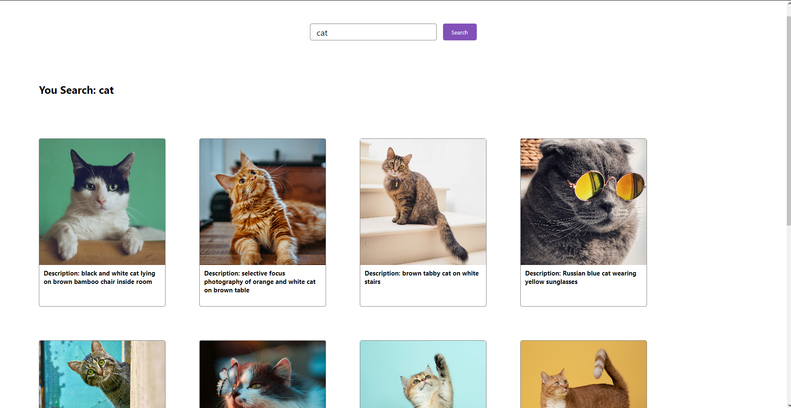

> ## WEB ADVANCED PHOTO SEARCH DOCUMENT

[Github](https://github.com/minhtrifit/web-advanced-photo-search)

### 1. Config .env 

**Create .env file in root directory & fill value below:**

```php

VITE_UNSPLASH_ACCESS_KEY="keyvalue"

```

### 2. Showcase

[Demo](https://20120217-myphoto.netlify.app)

